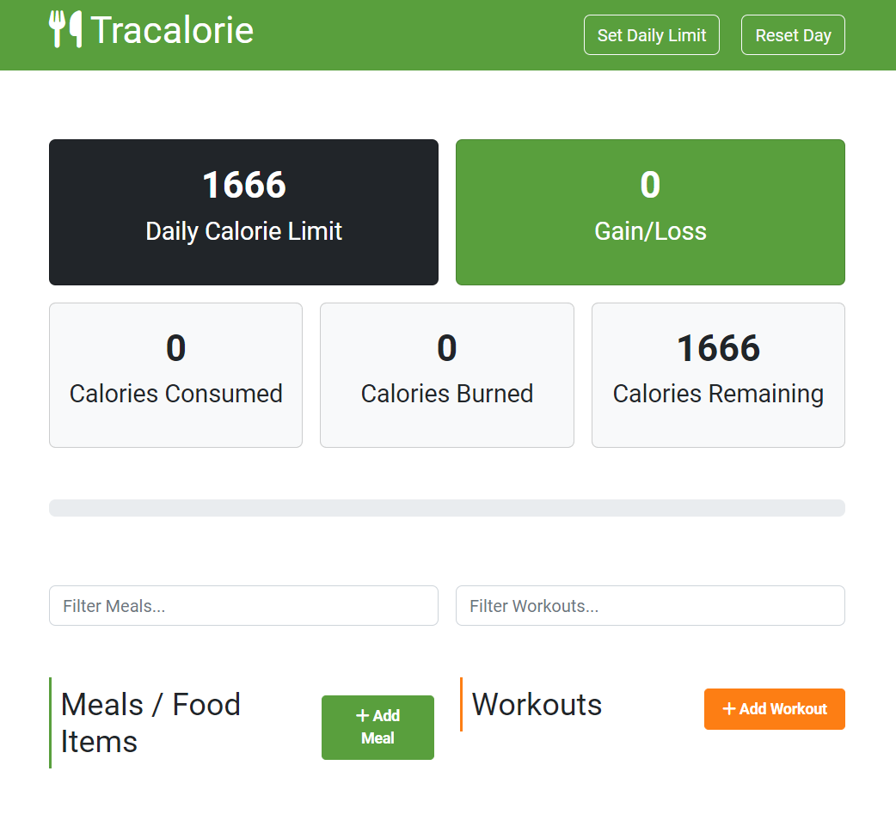

# Modern JavaScript From The Beginning


This repository tracks my progress for the "Modern JavaScript From The Beginning" course on Udemy, as part of the Bay Valley Tech Code Academy.

I'm following the course by copying the starting files and then filling them out as I progress. I also publish my project progress here and include deployment links in this README.

Course Link: [Modern JavaScript From The Beginning on Udemy](https://www.udemy.com/course/modern-javascript-from-the-beginning/)
## Projects

### Shopping List App


- [Live Demo](https://main--sillor-shopping-list.netlify.app/)
- [Repository](https://github.com/Sillor/udemy-modern-js-from-the-beginning/tree/main/08-shopping-list-project/shopping-list)

### Tracalorie App



- [Live Demo](https://marvelous-paletas-c8dffa.netlify.app/)
- [Repository](https://github.com/Sillor/udemy-modern-js-from-the-beginning/tree/main/15-tracalorie-project)

## Course Overview

This course covers various aspects of modern JavaScript development, but here is what I documented in this repo:

- DOM manipulation
- Events
- Shopping List Project
- Asynchronous JavaScript
- OOP - Constructors & Prototypes
- OOP - Classes, Getter & Setters, Private Properties, etc
- Tracalorie App - OOP Project

## Repository Structure

To understand this repository, follow these steps:

1. Clone this repository:

   ```bash
   git clone https://github.com/Sillor/udemy-modern-js-from-the-beginning
   ```
2. Every folder inside the root folder of this repository represents a different section from the course.